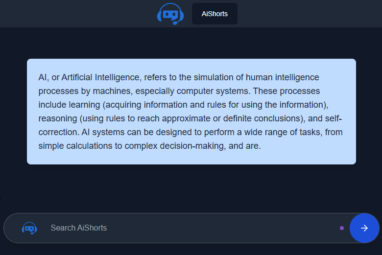
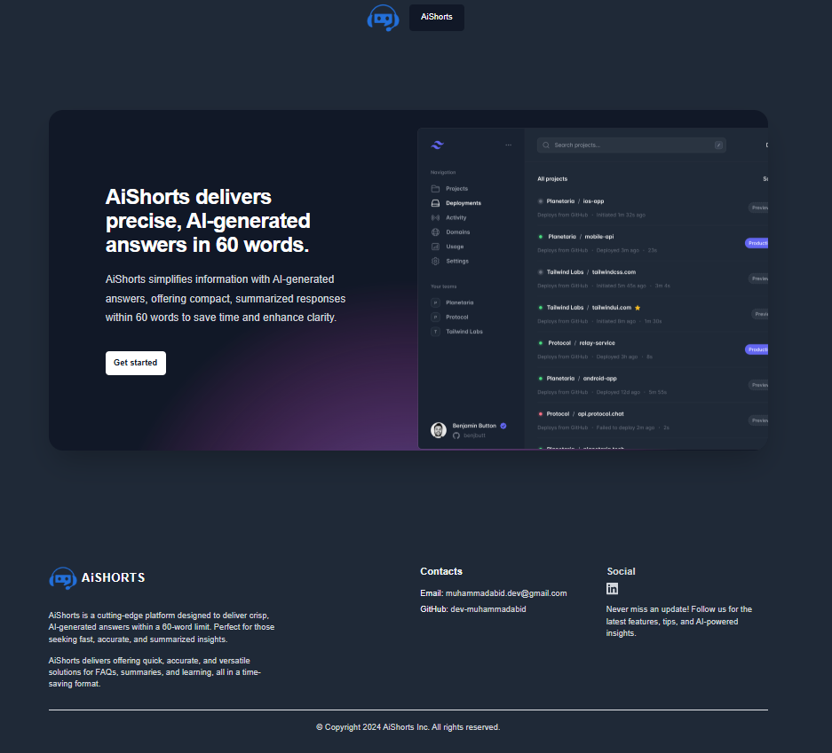

# AiShorts🤖✨

**Author:** Muhammad Abid  
**Year:** 2024  

## Overview

**AiShorts**: The smart app delivering concise, precise answers in just 60 words! This innovative application leverages AI technology to provide short, accurate, and informative responses to user queries, ensuring quick and effective information retrieval.

## 🚀 Features

- 🔄 Real-time bi-directional communication using **WebSocket (STOMP + SockJS)**
- 🎨 Clean and responsive chat UI using **TailwindCSS** & **Material Tailwind**
- 🔒 AI response history is saved using JPA & MySQL
- ⚙️ REST fallback API to get answers from Gemini
- 🧠 Simulates intelligent, ChatGPT-like answers
- 📜 Custom animated chat bubbles for both user and AI
- 🌐 Deployed over WebSocket endpoint `/ws-chat`


## 🛠️ Tech Stack

| Layer       | Technology                  |
|------------|-----------------------------|
| Backend     | Java, Spring Boot, Spring WebSocket |
| Frontend    | React.js, Tailwind CSS, Material Tailwind, Framer Motion |
| Messaging   | STOMP, SockJS               |
| AI Logic    | Gemini / OpenAI (via `ChatService`) |
| DB          | MySQL, Spring Data JPA      |

---

## 📦 Folder Structure

AiShorts/
├── backend/
│ ├── controllers/
│ ├── services/
│ ├── entities/
│ ├── repositories/
│ ├── config/
│ └── Application.java
├── frontend/
│ ├── components/
│ ├── Prompt.jsx
│ ├── Response.jsx
│ ├── ChatBubble.jsx
│ └── index.js


## ⚙️ Getting Started

### Backend

```bash
cd backend
./mvnw spring-boot:run
```
* WebSocket endpoint: ws://localhost:8080/ws-chat

* REST endpoint: POST /aishorts/prompt

* Fetch history: GET /aishorts/history

### FrontEnd

```bash
cd frontend
npm install
npm run dev
```

📡 WebSocket Communication

Send user prompt to:
/app/sendMessage

Listen to AI responses at:
/topic/messages

Sample Payload:
Send:
```
json: { "text": "What is AI?" }
```
Receive:
```
json: {
  "candidates": [
    {
      "content": {
        "parts": [
          { "text": "AI stands for Artificial Intelligence..." }
        ]
      }
    }
  ]
}
```

## 🧪 Testing
Make sure both the frontend and backend are running

Open browser at http://localhost:5173 (or your frontend port)

Type a message and wait for a real-time AI response

## 📖 License
This project is licensed under the MIT License - see the LICENSE file for details.

## 🙌 Acknowledgements
Google Gemini / OpenAI for LLM APIs
Material Tailwind UI for sleek design
STOMP & SockJS for reliable WebSocket support

## Screenshots

### 1. AiShorts Logo


---

### 2. Chat Interface


---

### 3. Homepage


---

### 4. Powered by Gemini

